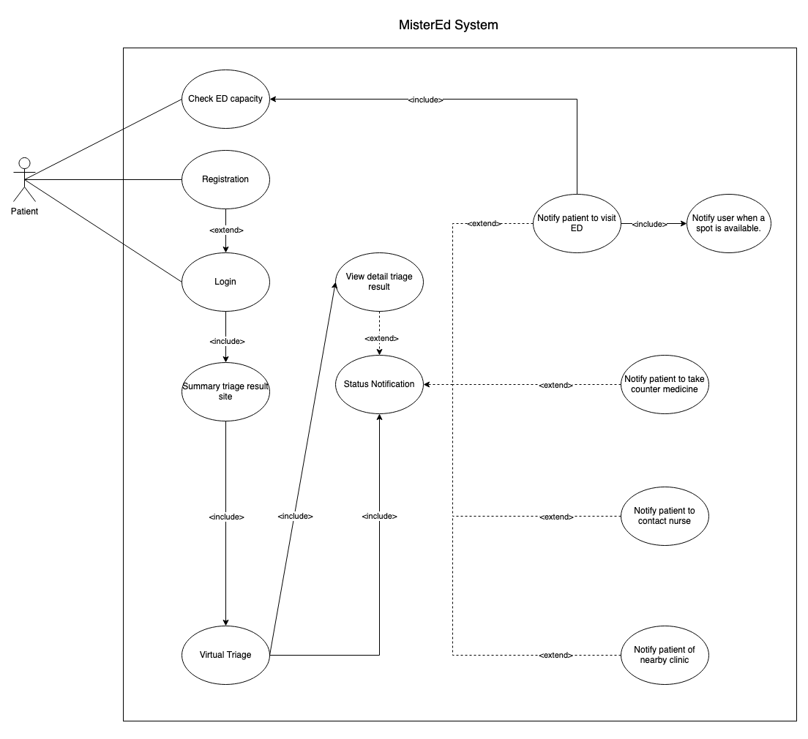

# MisterEd

## System Description:

The MisterEd system is envisioned as a solution aimed at mitigating the burdens of overcrowding and prolonged wait times within Emergency Departments (EDs) across Canada. It is designed to allows users to both check the current load of the ER as well as register/log in for a virtual triage. The virtual triage involves the user providing necessary medical information, allowing the system to conduct an initial assessment of their condition. After this virtual triage is complete, their patient data will be updated and the user will be notified of which actions they should follow. In cases where an ER visit is deemed necessary, the system integrates the user into a virtual ER queue, prioritizing them based on the urgency of their condition. The user will then be notified when the ER is ready for them (front of the queue), significantly reducing their wait time and enhancing the overall ED experience. The system will reserves a spot for the user at the ER for a designated period, after which the user will be removed from the queue. If the patient may not require an ER visit, they will be directed to suitable alternatives, relayed to either a nurse hotline, regular primary care clinic, or over-the counter-medication. Thus, the system helps to optimize the utilization of healthcare resources and promote timely and appropriate care for all users.

## Use Case Diagram

## Use Case Specifications
### Use Case UC-01 System Overview
| Use Case    | UC-01 System Overview                                              |
|-------------------|--------------------------------------------------------------------|
| **Description**    | This use case provides an overview of how to access and use the MisterEd system. |
| **Assumption**     |The user is seeking medical guidance or assistance through the MisterEd system. They may be experiencing a health issue or concern and are using MisterEd to assess whether their situation requires a visit to an Emergency Department (ED). Users may choose to either create a new MisterEd account if using the system for the first time or log in with their existing account for access. |
| **Actors**         | - User/Patient|
| **Steps**          | 1. **User Registration/Login:**  - The user either logs in with their existing MisterEd account or registers for a new account for the first time.  2. **Assessment for Nearby ED Availability:**  - The user determines if there is an available Emergency Department (ED) nearby.  3. **Health Information Submission:**  - The user utilizes MisterEd to provide personal health information to begin a virtual triage.   4. **Virtual Triage:**  - The system conducts a virtual triage based on the provided health information to determine the appropriate course of action for the user.   5. **User Notification:**   - The system notifies the user of the recommended action based on the triage result.      5.1. If the user should visit a nearby ED:  - The system searches for a spot in the queue at the nearest clinic.   - The user is notified when an ED slot becomes available, and the system assists the user in registering for it.     5.2. Otherwise, if the user should receive medical assistance through alternative means:   5.2.1 If the user should receive a prescription:   - The system notifies the user of the nearby pharmacy where they can obtain their prescribed medication.   5.2.2 If the user should talk to a nurse via a hotline:   - The system notifies the user and provides access to a nurse hotline for immediate assistance.   5.2.3 If the user should visit a clinic to see a GP:   - The system notifies the user of a nearby clinic and assists in setting up an appointment with a General Physician (GP). |
| **Variations**     |     |
| **Non-Functional Requirements** | **Reliability:** Given the potential urgency of a user’s needs, the system must ensure that status notifications reach the respective recipients as soon as possible.   **Security**: The system must stores the encrypted data and regularly perform data backup of sensitive user information, including the detail results of user's triage.   **Security**: The system will follow the standard policies, such as Protection of Privacy and Access to Information Policy, guaranteeing the safety of user's personal information stored ( location, health record, medicine prescription, passwords, etc.)  |
| **Issues**         | - **Miscummunication:** In some cases, the system may misinterpret user health information, resulting in incorrect recommendations.   - **Inconsistent Notifications:** Users report receiving inconsistent or delayed notifications regarding the availability of ED spots or appointments.   - **System overload**: The system may face potential issues if a large number of patients simultaneously access the triage feature, leading to the possibility of system overload and crashes. Additionally, given the current ED crisis in Canada, there may not be a sufficient number of available ED slots for patients to book through the system, which could impact user experience and service availability.|
 
### Use Case UC-02 User Authentication
| Use case       | UC-02 System Login   |
|----------------|------------------------------------------------------------------------------------------------------------------------------------------------------------------------------------------------------------------------------------------------------------------------------------------------------------------------------------------------------------------------------------------------------------------------------------------------------------------------------------------------------------------------------------------------------------------------------------------------------------------------------------------------------------------------------------------------------------------------------------------------------------------------------------------------------------------------------------------------------------------------------------------------------------------|
| Description    | The user can login to the mister ED system by inputing their credentials and selecting login          
| Actors         | User                                                
| Assumption     | 1. The Mister ED System is Online/Active   2. The user can access the Mister ED welcome/home page |
| Steps          | 1. On the welcome/home page, the user selects the "Login/register" button.   2. The screen updates the current page to the one with the input boxes for login credentials.   3. The User inputs their Username and Password.  4. The User selects the "login button".   5. **IF** the user input is validated:   - The user should now be logged in.   **ELSE**:   - The user is asked to input their information again.
| Variations     | 1. The user attempts login with incorrect credentials.   2. The user forget their account login information.   3. The user wants to change their account's password. |
| Non-functional |  **Reliability**: After pressing login, the result (successful login or page refresh with error) should occur within twenty seconds.   **Usability**: A message should occur indicating whether the user has successfully logged in when they press login.   **Security**: The user cannot be logged in with incorrect credentials.   **Security**: The system must stores the encrypted data and regularly perform data backup of sensitive user information, including the detail results of user's triage.   **Security**: The system will follow the standard policies, such as Protection of Privacy and Access to Information Policy, guaranteeing the safety of user's personal information stored ( location, health record, medicine prescription, passwords, etc.)   |
| Issues         | 1. Login may be unavailable during a system update or maintainance.   |

#### Use Case UC-02.1 Failed Login extends User Authentication
| Use case extension  | UC-02.1 failed login **extends** System login |
|----------------|------------------------------------------------------------------------------------------------------------------------------------------------------------------------------------------------------------------------------------------------------------------------------------------------------------------------------------------------------------------------------------------------------------------------------------------------------------------------------------------------------------------------------------------------------------------------------------------------------------------------------------------------------------------------------------------------------------------------------------------------------------------------------------------------------------------------------------------------------------------------------------------------------------------|
| Change         | User is not logged in when the login button is selected  |                                                             
| Assumption     | 1. User inputs the wrong login credentials.   2. User is on login page |
| Steps          | 1.1 On the login page, the user inputs their incorrect login credentials.   1.2 User selects the login button.  1.3 User input is not validated and system displays a failed login error and asks to input their information again. |

#### Use Case UC-02.2 Forgot Credentials extends User Authentication
| Use case extension  | UC-02.2 Forgot credentials **extends** System login|
|----------------|------------------------------------------------------------------------------------------------------------------------------------------------------------------------------------------------------------------------------------------------------------------------------------------------------------------------------------------------------------------------------------------------------------------------------------------------------------------------------------------------------------------------------------------------------------------------------------------------------------------------------------------------------------------------------------------------------------------------------------------------------------------------------------------------------------------------------------------------------------------------------------------------------------------|
| Change         | User does not remember credentials  |                                                             
| Assumption     | 1. User has missing login credentials.   2. User wants to change their password.   3. User is on login page|
| Steps          | 1.1 On the login page, user selects the forgot password buttion.  1.2 User is directed to forgot password interface.   1.3 User received a text message/ email to their registered address with a link to a site that they can reset their password.   1.4 User is request to input the new password and confirm their new password.   1.5 An email will be sent to user to notify that the password is reset.   1.6 User is redirected to the login interface.  |

#### Use Case UC-02.2 User Registration extends User Authentication
| Use case extension       | Use Case UC-02.3 User registration **extends** System login |
|----------------|------------------------------------------------------------------------------------------------------------------------------------------------------------------------------------------------------------------------------------------------------------------------------------------------------------------------------------------------------------------------------------------------------------------------------------------------------------------------------------------------------------------------------------------------------------------------------------------------------------------------------------------------------------------------------------------------------------------------------------------------------------------------------------------------------------------------------------------------------------------------------------------------------------------|
| Description    | The goal of this use case is to enable users to successfully create their account in the system. Requirements for this include user's login credentials that they want to set.            
| Actors         | Patient/User (Primary).                                                  
| Assumption     | 1. The Mister ED System is Online/Active.   2. The user does not have an account in the system. |
| Steps          | 1. On the welcome/ home page, the user clickes the "Registration" button to creates a new account in the system.   2. The system then takes the user to a different page to complete their registration.   3. The user is asked to input required information.   4. **IF** user input is validated:   - A pop up message will prompt to inform user that their account has been created successfully.   - The user is redirect to the login page.   - The user then re-enters the log-in credentials to log-in to the system.   **ELSE**:   - System display failure error indicating the fields that user needs to input again. | 
Issues         |  The main issue that may arise if the patient already has an account, and tries to re-register with the same log-in credentials. |

### Use Case UC-03 Perform Virtual Triage
| Use Case       | UC-03 Virtual Triage |
|----------------|------------------------------------------------------------------------------------------------------------------------------------------------------------------------------------------------------------------------------------------------------------------------------------------------------------------------------------------------------------------------------------------------------------------------------------------------------------------------------------------------------------------------------------------------------------------------------------------------------------------------------------------------------------------------------------------------------------------------------------------------------------------------------------------------------------------------------------------------------------------------------------------------------------------|
| Description    | The system conduct a virtual triage on patient's health condition based on user medical information.            
| Actors         | Patient/User (Primary).                                                  
| Assumption     | 1. The Mister ED System is Online/Active.   2. The user has already registered with their health information on the system. |
| Steps          | 1. The user log-in or register new account following the use case UC-02.   2. The user starts the virtual triage to determine if going to the ER is the only option.   3. The user input required information about their health condition.   4. The system notifies that it receives user information and will send notification to the user when the results of the triage is available.
| Issues         |  The main issue that may arise when going through the virtual triage is if the patient's condition becomes dangerous, for example if the patient were to lose consciousness while using the system and no one was with them, then the patient might not be able to get the right treatment in time. |

### Use Case UC-04 Notify Triage's Result             
| Use case       | UC-04 Notify triage's result                                                                                                                |
|----------------|------------------------------------------------------------------------------------------------------------------------------------------------------------------------------------------------------------------------------------------------------------------------------------------------------------------------------------------------------------------------------------------------------------------------------------------------------------------------------------------------------------------------------------------------------------------------------------------------------------------------------------------------------------------------------------------------------------------------------------------------------------------------------------------------------------------------------------------------------------------------------------------------------------------|
| Description    | To notify the user the results of the triage and the actions they should take after they did the virtual triage.                                                                         |
| Actors         | Patient                                                                             |
| Assumption     | The patient provides correct information about their health condition and finishes the triage.                                                                               |
| Steps          | 1. The patient receives a notification via phone or email that the result for their triage is available and they can click on the link to view the results.   2. The patient clicks on the link and is taken to the system.   3. The user is asked to log in into the system if they have not logged in yet.   4. Based on the result, system will display different views and user will receive different message:         4.1. **IF** the result is the user need to go to ER:           - The user will receive notification about they can be queued in the line for ER (UC-04.1)       4.2. IF the user needs to take medicines:          - The user will receive notification about their results and be suggested to take medicines (UC-04.2)       4.3. **IF** the user needs to contact nurse/clinician:          - The user will receive notification about their results that they need to contact nurses/clinicians (UC-04.3) |
| Variations     | The user can log in into their account and view the notification by clicking the notification icon on the top left of the interface.                                                                                                                             |
| Non-functional | **Reliability**: The system will display the notification to the user with a latency fewer than 5 minutes.   **Reliability**: The system will display and keep remind user about the unread notifications they have.   **Security**: The system must stores the encrypted data and regularly perform data backup of sensitive user information, including the detail results of user's triage.   **Security**: The system will follow the standard policies, such as Protection of Privacy and Access to Information Policy, guaranteeing the safety of user's personal information stored ( location, health record, medicine prescription, passwords, etc.)   **Usability** The interface of the notification site shall score at least 90 on Lighthouse Perfomance Test to ensure that users can navigate in the information and the flow of checking notification and viewing the detail result of triage.   **Usability**: User with experience of interactive of the site shall be able to view the triage results within 5 minutes and 15 minutes for those without experience with the interface in advance.                                                                          |
| Issues         | Based on user profile and triage result, there may be not available resources for the patient (for example, there may not be available medicine or nurse/clinician in patient's area)                                                               
#### Use Case UC-04.1 Notify Patient To Go To ED extends Notify Triage's Result               
| Use case extension       | UC-04.1 Notify patient to go to ED extends UC-04 Notify triage's result                                                                        |
|----------------|---------------------------------------------------------------------------------------------------------------------------------------------------------------------------------------------------------------------------------------------------------------------------------------------------------------------------------------------------------------------------------------------------------------------------------------------------------------------------------------------------------------------------------------------------------------------------------------------------|
| Change    | To notify the user the results of the triage and suggest the user to visit ER after they did the virtual triage                                                                     
| Steps          | 1. The patient receives a notification via phone or email that the result for their triage is available and they can click on the link to view the results.    2. The patient clicks on the link and is taken to the system.   3. The user is asked to log in into the system if they have not logged in yet.   4. The system will display a view to show the user that they need to visit ER.   5. The user can click to see the full detail result of their triage.   6. The user can also click on a button and the system can help them check the available of and place them in the queue for ER.  |
| Variations     | The user can log in into their account and view the notification by clicking the notification icon on the top left of the interface.                                                                                      |
| Non-functional | **Reliability**: The system will display the notification to the user with a latency fewer than 5 minutes.   **Reliability**: The system will display and keep remind user about the unread notifications they have.   **Security**: The system must stores the encrypted data and regularly perform data backup of sensitive user information, including the detail results of user's triage.   **Security**: The system will follow the standard policies, such as Protection of Privacy and Access to Information Policy, guaranteeing the safety of user's personal information stored ( location, health record, medicine prescription, passwords, etc.)   **Usability** The interface of the notification site shall score at least 90 on Lighthouse Perfomance Test to ensure that users can navigate in the information and the flow of checking notification and viewing the detail result of triage.   **Usability**: User with experience of interactive of the site shall be able to view the triage results within 5 minutes and 15 minutes for those without experience with the interface in advance.   **Security**: The system must stores the encrypted data and regularly perform data backup of sensitive user information, including the detail results of user's triage.   **Security**: The system will follow the standard policies, such as Protection of Privacy and Access to Information Policy, guaranteeing the safety of user's personal information stored ( location, health record, medicine prescription, passwords, etc.)                                                                                                    |
| Issues         | Based on user profile and triage result, there may be not available resources for the patient (for example, it may take too long for the patient to wait until they have an available spot for ER)                                                                                         |                                                    
#### Use case UC-04.2 Notify Patient To Take Over The Counter Medication extends Notify Triage's Result               
| Use case extension     | UC-04.2 Notify patient to take over the counter medication extends UC-04 Notify triage's result                                                                                                                                                   |
|----------------|---------------------------------------------------------------------------------------------------------------------------------------------------------------------------------------------------------------------------------------------------------------------------------------------------------------------------------------------------------------------------------------------------------------------------------------------------------------------------------------------------------------------------------------------------------------------------------------------------------------|
| Change    | To notify the user the results of the triage and suggest the user to take over the counter medication after they did the virtual triage                                                                                   |
| Steps          | 1. The patient receives a notification via phone or email that the result for their triage is available and they can click on the link to view the results.    2. The patient clicks on the link and is taken to the system.   3. The user is asked to log in into the system if they have not logged in yet.   4. The system will display a view to show the user that they only need to take over the counter medication.   5. The user can click to see the full detail result of their triage.   6. The user can also see the list of suggesting near-by pharmacies so they can visit and get their medication. |
| Variations     | The user can log in into their account and view the notification by clicking the notification icon on the top left of theinterface.                                                                             |
| Non-functional | **Reliability**: The system will display the notification to the user with a latency fewer than 5 minutes.   **Reliability**: The system will display and keep remind user about the unread notifications they have.   **Security**: The system must stores the encrypted data and regularly perform data backup of sensitive user information, including the detail results of user's triage.   **Security**: The system will follow the standard policies, such as Protection of Privacy and Access to Information Policy, guaranteeing the safety of user's personal information stored ( location, health record, medicine prescription, passwords, etc.)   **Usability** The interface of the notification site shall score at least 90 on Lighthouse Perfomance Test to ensure that users can navigate in the information and the flow of checking notification and viewing the detail result of triage.   **Usability**: User with experience of interactive of the site shall be able to view the triage results within 5 minutes and 15 minutes for those without experience with the interface in advance.                                                                       |
| Issues         | Based on user profile and triage result, there may be not available resources for the patient (for example, there may not be available medicine in patient's area)                                                                                                                                |                                                  |

#### Use case UC-04.3 Notify Patient To Contact The Nurse/Clinician Hotline extends Notify Triage's Result                  
| Use case extension       | UC-04.3 Notify patient to contact the nurse/clinician hotline extends UC-04 Notify triage's result                                                                                                                                      |
|----------------|------------------------------------------------------------------------------------------------------------------------------------------------------------------------------------------------------------------------------------------------------------------------------------------------------------------------------------------------------------------------------------------------------------------------------------------------------------------------------------------------------------------------------------------------------------------------------------------------------------------------------------------------|
| Change    | To notify the user the results of the triage and suggest the user to contact the nurse/clinician hotline after they did the virtual triage|
| Steps          | 1. The patient receives a notification via phone or email that the result for their triage is available and they can click on the link to view the results.   2. The patient clicks on the link and is taken to the system.   3. The user is asked to log in into the system if they have not logged in yet.   4. The system will display a view to show the user that they only need to contact the nurse/clinician hotline.   5. The user can click to see the full detail result of their triage.   6. The user can also see the list of suggesting near-by clinic with their contact information so they can contact them via phone or walk-in. |
| Variations     | The user can log in into their account and view the notification by clicking the notification icon on the top left of the interface.                                                                                 |
| Non-functional | **Reliability**: The system will display the notification to the user with a latency fewer than 5 minutes.   **Reliability**: The system will display and keep remind user about the unread notifications they have.   **Security**: The system must stores the encrypted data and regularly perform data backup of sensitive user information, including the detail results of user's triage.   **Security**: The system will follow the standard policies, such as Protection of Privacy and Access to Information Policy, guaranteeing the safety of user's personal information stored ( location, health record, medicine prescription, passwords, etc.)   **Usability** The interface of the notification site shall score at least 90 on Lighthouse Perfomance Test to ensure that users can navigate in the information and the flow of checking notification and viewing the detail result of triage.   **Usability**: User with experience of interactive of the site shall be able to view the triage results within 5 minutes and 15 minutes for those without experience with the interface in advance.                                                                  |
| Issues         | Based on user profile and triage result, there may be not available resources for the patient (for example, there may not be available nurse/clinician in patient's area)                                                                   |

### Use Case UC-05 Assign User To ER Queue
| Use case       | UC-05 Assign User To ER Queue |
|----------------|------------------------------------------------------------------------------------------------------------------------------------------------------------------------------------------------------------------------------------------------------------------------------------------------------------------------------------------------------------------------------------------------------------------------------------------------------------------------------------------------------------------------------------------------------------------------------------------------------------------------------------------------------------------------------------------------------------------------------------------------------------------------------------------------------------------------------------------------------------------------------------------------------------------|
| Description    | User is assigned to an appropriate ER queue position using user location and virtual triage data.              
| Actors         | Patient/User                       
| Assumption     | The patient provides correct information about their health condition and finishes the triage and their data is correctly processed. |
| Steps          | 1. The information from the triage is used to determine the urgency and position in ED queue that the user will take.   2. User is informed of their current position in queue.    3. When the user has reached the front of the queue, they will be notified again to come to the ED.   4. When the user arrives at the ED, they are ID'd and matched to their online information, and then processed accordingly by ED front desk operator.   5. Once processed the user is removed from the queue.
| Variations     |   1. User may decide to cancel and be removed from the queue.   2. User fails to arrive within specified time frame, they are removed from the queue and notified.|
| Non-functional | **Reliability**: ER queue system must be reliable 95% of the time. Down time is acceptable as users will just go to the ED in person.   **Priority**: ER queue system must be able to effectivley decide urgency and priority of users in such a manner that users do not deem it nessecary to show up to the ED before their alloted time. |
| Issues         |   How does the ED staff interact with the system? How are in-person ED visitors accounted for in the system? |

#### Use case UC-05.1 Remove User From ER Wating Queue extends UC-05 Assign User To ER Queue                  

| Use case extension  | UC-05.1 Remove user from ER waiting queue **extends** Assign user to ER queue |
|----------------|------------------------------------------------------------------------------------------------------------------------------------------------------------------------------------------------------------------------------------------------------------------------------------------------------------------------------------------------------------------------------------------------------------------------------------------------------------------------------------------------------------------------------------------------------------------------------------------------------------------------------------------------------------------------------------------------------------------------------------------------------------------------------------------------------------------------------------------------------------------------------------------------------------------|
| Change         | User is removed from ER queue  |                                                             
| Assumption     | User is currently in ER queue|
| Steps          | 2.1 If the user clicks on the "remove from queue" button.   2.2 A pop-up message will prompt to ask user confirm their choice.   2.3 **IF** user confirms, then, the user is notified they were removed from queue.   **ELSE**, the task is cancel and user remains in the ER waiting queue. |

#### Use case UC-05.2 Remove User From ER Reservation extends Assign User To ED Queue
| Use case extension  | UC-05.2 Remove user from ER reservation **extends** Assign user to ER queue|
|----------------|------------------------------------------------------------------------------------------------------------------------------------------------------------------------------------------------------------------------------------------------------------------------------------------------------------------------------------------------------------------------------------------------------------------------------------------------------------------------------------------------------------------------------------------------------------------------------------------------------------------------------------------------------------------------------------------------------------------------------------------------------------------------------------------------------------------------------------------------------------------------------------------------------------------|
| Change         | User is removed from ER queue. |                                                                    
| Assumption     | 1. User is currently in ER queue.   2. User has exceeded given time period for ER visit|
| Steps          | 2.1 If the user fails to arrive within specified time period, then they are removed from queue in the system.   2.2 User is notified that they have failed to show up in their alloted time and have been removed from the queue. |
| Issues         | Timing can be tricky, if someone is in serious peril they shouldn't be turned away because of technicality |

### Use Case UC-06 Check ER Queue Load

| Use case       | UC-6 Check ER queue load  |
|----------------|------------------------------------------------------------------------------------------------------------------------------------------------------------------------------------------------------------------------------------------------------------------------------------------------------------------------------------------------------------------------------------------------------------------------------------------------------------------------------------------------------------------------------------------------------------------------------------------------------------------------------------------------------------------------------------------------------------------------------------------------------------------------------------------------------------------------------------------------------------------------------------------------------------------|
| Description    | When the user chooses to view the current load on the ER queue.            
| Actors         | Patient/User                                                  
| Assumption     | 1. The Mister ED System is Online/Active.   2. The user can access the Mister ED welcome/home page |
| Steps          | 1. On the welcome/ home page, the user selects the "Check Current load" button.   2. A map view and a form appears and asks user to input their location or allow the system to access their location information.   3.The screen updates the current page to the one displaying the ED load measurement based on user input.   3. The User can now view the current load on the ED.
| Variations     | N/A|
| Non-functional |   Reliability: the load data for the ED will be accurate within the most recent 5 minutes.    Usability: The displayed data for the ED load will update without the need for the user to reload the page.   Security: Only the Current load data can be accessed  |
| Issues         |   The ability to access Load data may be lost to the user for the duration of a power failure or duration taken to update the mister ED system. |
