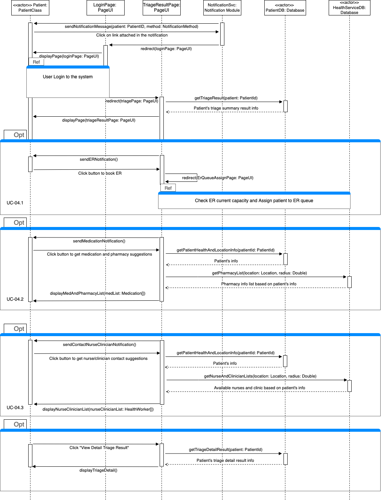
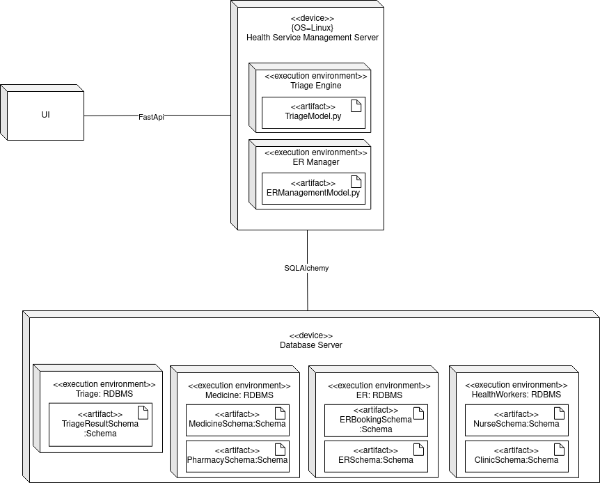

## Design - Component & Connector View

UML Component Diagram and textual description of design explaining each microservice
Sequence Diagrams for each Scenario (each use case) and textual description
### Sequence Diagram
#### Use Case UC-01 System Overview

#### Description:
- **Participant**:
  - Patient (type: Actor)
  - Account Page (type: PageUI)
  - Virtual Triage (type: Virtual Triage module)
  - HealthService Database (type: Database)
  - Patient Database (type: Database)

- **Fragments**:
  - OPT Fragments for ER Service, Nurse Service, Pharmacy Visit, Clinic Visit.

- **Process**:
  - __Account Creation__: The patient can begin utilizing MisterEd by establishing an account, providing basic information during the registration process. The input will be securely stored in the Patient Database for both record-keeping and authentication purposes. Upon successful account creation, the patient will be directed to a summary page, showcasing the details of their newly established account.
  - __Logging in (Authentication)__: The patient is required to provide their username and password to access their accounts. The submitted credentials will be compared with records in the Patient Database. Upon successful authentication, users will be directed to the summary page of their account.
  - __Checking ED Capacity__: When the patient click the button to check the capacity of the nearest ED, the account page will request relevant information from the Health Service Database. The obtained information will be displayed to the patient.
  - __Requesting a Virtual Triage__: When patients click the button to request a Virtual Triage, they are required to provide recent basic health information, which will be sent to update records in the Patient Database. The health input is also used to initiate a triage with the Virtual Triage module. Based on the health input, the following options will be suggested.
    - _Visiting the Nearest ER_: If a visit to the ER is necessary, the account page will notify the patient of the recommendation. Once the patient requests the service, the Account Page will gather relevant patient information from Patient's Database, such as health status and location, which will then be used to query the Health Service Database for the nearest ED location. The account page will also search for any available spots in the queue and, if available, the patient will be notified of its availability.
    - _Contacting a Nurse_: If reaching out to a nurse is necessary, the account page will notify the patient of the recommendation. Once the service is requested, the Account Page will retrieve relevant patient information, such as health status and location, from the Patient Database. This information will be utilized to query the Health Service Database for the appropriate nurse hotline. The patient will be notified of the hotline to contact the nurse.
    - _Visiting a Clinic_: If a clinic visit is recommended, the account page will inform the patient of this advice. Upon service request, the Account Page will extract pertinent patient information, like health status and location, from the Patient Database. This data will subsequently be used to query the Health Service Database to identify the nearest clinic. The patient will then be notified of the location to visit.
    - _Taking Medication_: If taking prescribed medication is necessary, the account page will notify the patient of this recommendation. Upon service request, the Account Page will retrieve pertinent patient information, such as health status and location, from the Patient Database. This information will then be used to query the Health Service Database to identify the nearest pharmacy. Subsequently, the patient will be informed of the pharmacy location to visit.

### Sequence Diagram Specification
#### Use Case UC-02 User Authentication

#### Use Case UC-03 Perform Virtual Triage

#### Use Case UC-04 Notify Triage's Result

__Participant__:
- Patient (Actor)
- Login Page (type: PageUI)
- Triage Result Page (type: PageUI)
- Notification Module (type: NotificationSvc)
- Patient Database (type: Database)
- HealthService Database (type: Database)

__Combined Fragments__:
- Alt Fragment for the suggestion process
- Ref Fragment to Login Use case
- Ref Fragment to Check ER Capacity and Assign Patient to ER Queue

__Process__:
- When the triage result is available, the Notification Service will send a notification to patient via email or text message.
- Then the patient can click on the link attached in the email/text message to be redirect to the login page.
- The patient is required to log in first before viewing their triage result. Therefore, the diagram refers to the sequence diagram of authentication use case.
- After patient logs in successfully, the system will redirect user to the result page, the UI also send request to get the triage results summary from Patient Database, and display the information to the patient.
- Based on the result, there would be 3 different scenarios:
    - If the patient is suggested to take counter medicine, the triage page will display a message suggesting patient to take counter medication, the user can click on the button and the UI will send request to get patient info, such as location, allergies, as well as list of pharmacies near-by patient's location, then display that to patient.
    - If the patient is suggested to contact nurses/clinician, the triage page will display a message suggesting patient to take contact nurses/clinician, the user can click on the button to get more help and the UI will send request to get patient info, such as location, health record, as well as list of available nurses/clinic near-by patient's location and their contact, then display that to patient.
    - If the patient is suggested to visit the ER, the triage result page will display a message suggesting patient to visit ER, and ask if the patient wants the system to help them book and be placed in ER queue. If the patient agrees, they will be redirect to Booking ER page to the Check ER current capacity and assign patient to ER Queue Use case.
- Alternatively, patient can click on the button to view the detail of their triage result instead of summary.

#### Use Case UC-05 Assign User To ER Queue

#### Use Case UC-06 Check ER Queue Load

## Allocation View
### Front Page UI Microservice

### Health Service Mangement Microservice

#### Tech stack:
- **Python**: The main programming language for developing the service and leveraging libraries such as SQLAlchemy and FastAPI.
- **SQLAlchemy**: Used for interacting with databases and managing health service-related data efficiently.
- **FastAPI**: FastAPI is used to implement the API that allows interaction with the service. The API exposes endpoints for managing triage, accessing health service databases, and retrieving the state of the ER queue. FastAPI offers a modern and efficient way to build APIs with automatic interactive API documentation.

#### Service Components:
- **Triage Management**:
The triage management component handles the assessment and categorization of patients based on their medical condition and urgency. It assigns a triage level to each patient, indicating the severity of their condition, then suggests whether the patient needs to visit ER or take other actions. This component also manages the databases related to the health services. It stores and retrieves information about nurses details, clinic details, medicine information, medical inventory, and other relevant data. SQLAlchemy is used to interact with these databases.    
**ER Management Model**:
The ER Management component keeps track of the patients in the queue, their priority levels, estimated wait times, and other relevant information. It ensures a smooth flow of patients through the ER.
**Database**:
The microservice uses Relational database to store the information for nurses, clinician, medicine, and ER.
   
#### Integration and Communication:
The Triage management and ER Management components interact to ensure that patients are placed in the queue based on their triage results if necessary. The health service databases management component integrates with both the triage management and ER queue components to fetch and update relevant information based on patient assessments.
    
#### Demo

### Patient Mangement Microservice

At the heart of the system lies a Patient Database Server, running on a Linux operating system, serving as the central repository for patient data. This server hosts two critical schemas: TriageRecordSchema and UserHealthInfoSchema, which define the structure and relationships within the patient records. The communication between the server and the application components is facilitated through 
FastApi, a modern and efficient web framework.FastApi acts as the bridge, ensuring seamless interactions between the server and the 
User Interface (UI). 
The system's architecture extends further with the incorporation of an Account Management execution environment. This component manages user accounts and interactions, ensuring data security and access control. Additionally, the system incorporates a Patient: Relational Database execution environment, emphasizing the utilization of relational database management systems tailored specifically for patient data. The integration of SQLAlchemy, a powerful SQL toolkit, enhances database management efficiency, ensuring smooth communication 
between the server and the schemas. In this configuration, the system's components are interlinked, guaranteeing a secure, efficient, and highly responsive healthcare management system that caters to diverse user needs.

UML Deployment Diagram and textual description of chosen deployment technologies (per microservice). Describe and point out evidence that you have successfully deployment skeleton microservice stubs.
Team responsibility table showing which team members work on which microservice component

## Interface specifications
### Front Page UI Microservice

### Health Service Mangement Microservice
[Link to API Documentation](https://app.swaggerhub.com/apis-docs/HangD/myster-ed_health_svc_management/0.1.0#/default/)

### Patient Mangement Microservice
[Link to API Documentation](https://app.swaggerhub.com/apis-docs/minhn201/patient_management_m2/1.0.0#/)
